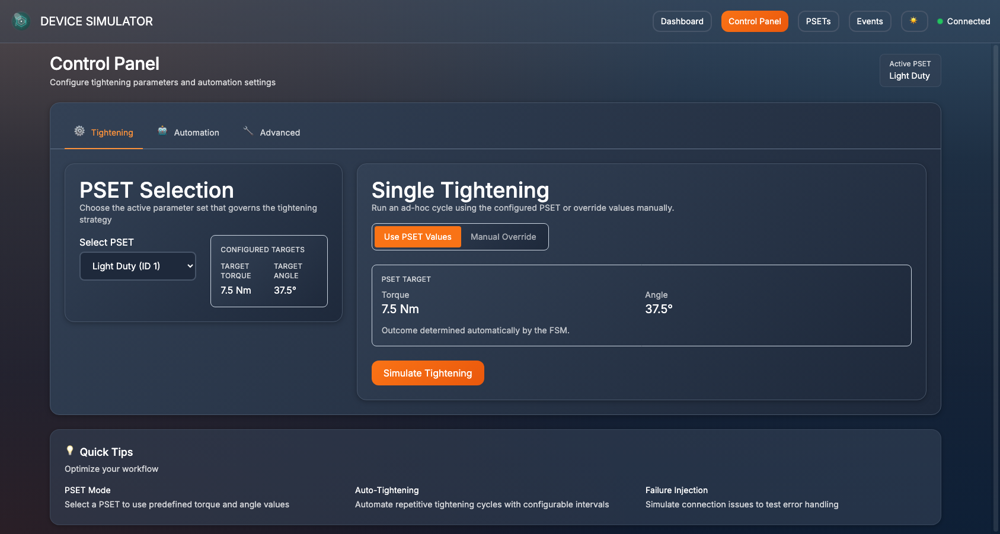
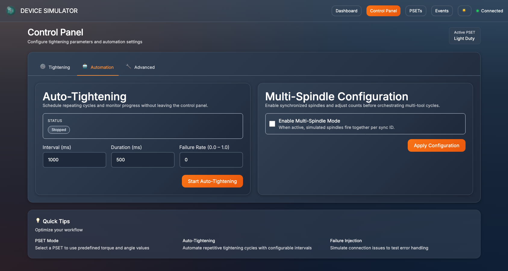
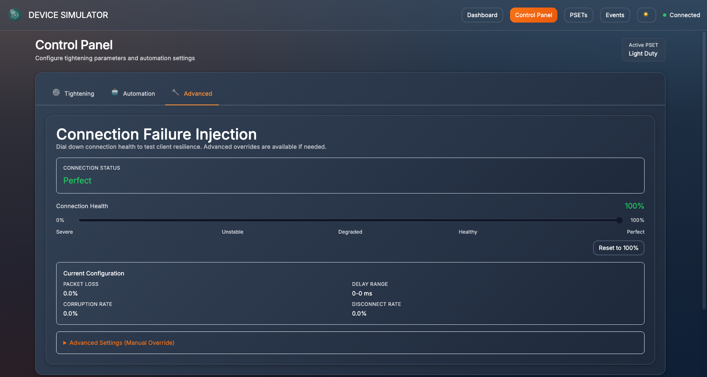
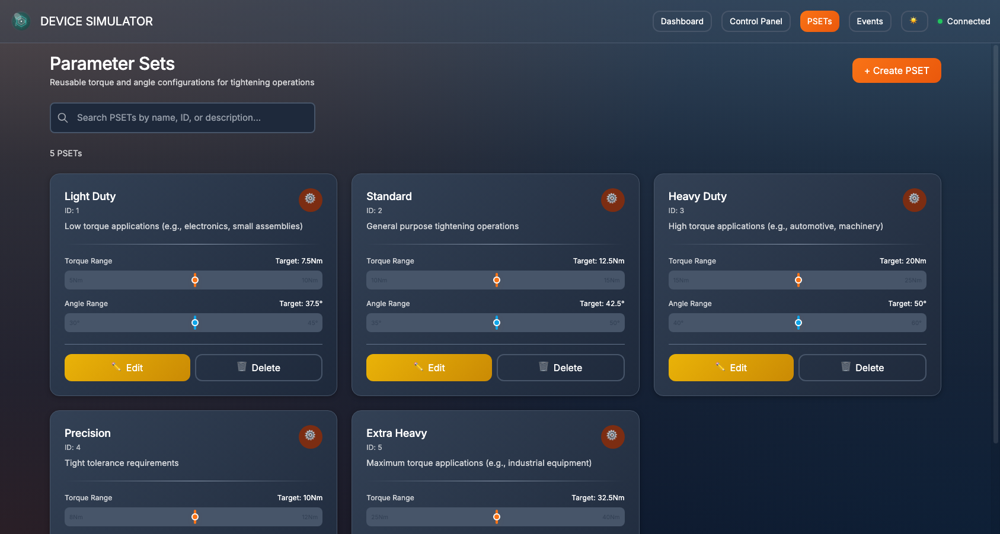
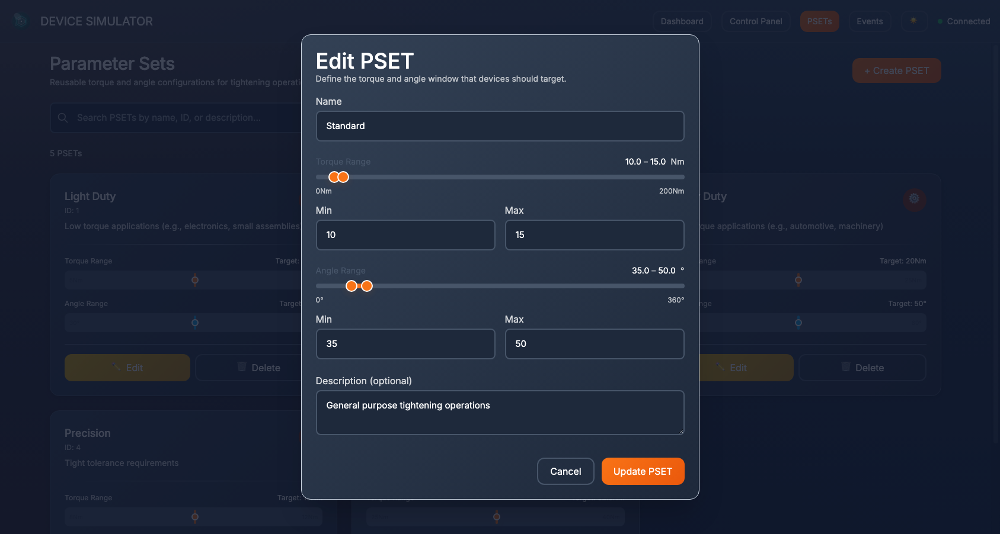
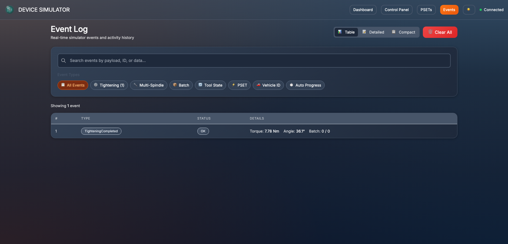

# Open Protocol Device Simulator

**A full-featured Rust simulator for Open Protocol tightening controllers with a modern web interface - test your MES/PLC integrations without physical hardware.**

[](https://opensource.org/licenses/MIT)
[](https://www.rust-lang.org)
[](https://kit.svelte.dev)


## The Problem

Integrating tightening tools (Atlas Copco, Desoutter, Stanley, etc.) into Manufacturing Execution Systems requires extensive testing. Physical controllers are expensive, often unavailable during development, and difficult to use for simulating edge cases, error conditions, and high-volume scenarios.

## The Solution

This simulator implements the **Open Protocol** specification with both a TCP server for integrations and a **modern web dashboard** for monitoring and control. Use it to:

- ✅ **Develop integrations** without waiting for hardware
- ✅ **Monitor real-time tightening** through an intuitive web interface
- ✅ **Test edge cases** (errors, timeouts, NOK results, network failures) that are hard to reproduce
- ✅ **Manage parameter sets** with full CRUD operations and persistence
- ✅ **Simulate multi-spindle** operations with synchronized tightening
- ✅ **Run CI/CD pipelines** with automated integration tests
- ✅ **Load test** your systems with high-frequency tightening cycles
- ✅ **Train developers** on Open Protocol without risking production equipment

## Why This Exists

I built this while working on MES integrations for manufacturing assembly lines. Every time we needed to test new integration code or troubleshoot issues, we'd either wait for hardware availability or risk disrupting production systems. This simulator eliminates that bottleneck.

**Important Note**: This simulator implements the **specific MIDs and features I needed** for my integration work. It covers the most common use cases (tightening results, batch management, parameter sets, multi-spindle) but is not a complete Open Protocol implementation. For example:
- Only **revision 1** of MIDs is supported (not revision 2+)
- **Job system** (MID 0030-0039) is not implemented
- Many advanced features are not yet implemented

This focused approach made it practical to build and maintain. The architecture is designed to be extensible, so additional features can be added as needed. Contributions welcome!

It's written in Rust for performance and type safety, with a SvelteKit frontend for a modern developer experience. The manufacturing industry needs better tooling.

## Screenshots

### Mission Control Dashboard
Real-time operations overview with device status, latest tightening results, connection health metrics, and live performance indicators.


### Control Panel - Tightening Configuration
Configure single tightening operations with PSET selection and manual parameter override options.



### Control Panel - Automation Settings
Automated tightening cycles and multi-spindle configuration for testing complex assembly scenarios.



### Control Panel - Failure Injection
Network failure simulation for resilience testing, with configurable packet loss, latency, and corruption rates.



### Parameter Set Management
Full CRUD interface for managing tightening parameter sets with visual torque/angle range displays.



### PSET Editor
Intuitive range sliders and real-time validation for torque and angle configuration.



### Event Log
Real-time event stream with filtering, search, and multiple view modes for debugging and monitoring.



---
## Quick Start

### Prerequisites
- **Rust 1.70+** ([Install Rust](https://rustup.rs/))
- **Node.js 18+** ([Install Node](https://nodejs.org/))

### Installation

```bash
git clone https://github.com/Jarrekstar/open-protocol-device-simulator
cd open-protocol-device-simulator

# Build backend
cargo build --release

# Install frontend dependencies
cd frontend
npm install
cd ..
```

### Run It

**Option 1: Backend + Frontend (Recommended)**
```bash
# Terminal 1: Start backend
cargo run --release

# Terminal 2: Start frontend dev server
cd frontend
npm run dev
```

Then open **http://localhost:5173** in your browser to access the web dashboard.

**Option 2: Backend Only**
```bash
cargo run --release
```

This starts:
- **TCP Server** on `0.0.0.0:8080` (Open Protocol)
- **HTTP API** on `0.0.0.0:8081` (REST & WebSocket)

### Test It

**Via Web Interface:**
1. Open http://localhost:5173
2. View real-time device status on the Dashboard
3. Go to Control Panel → Simulate a tightening
4. Watch the result appear in real-time

**Via Command Line:**
```bash
# Terminal 1: Start simulator
cargo run

# Terminal 2: Connect a client and subscribe to results
echo '00200060001         001' | nc localhost 8080

# Terminal 3: Trigger a tightening
curl -X POST http://localhost:8081/simulate/tightening \
  -H "Content-Type: application/json" \
  -d '{"torque": 12.5, "angle": 40.0, "ok": true}'
```

You should see a MID 0061 tightening result message in Terminal 2.

## Features

### 🎨 Web Dashboard

Modern, responsive web interface built with SvelteKit:

**Dashboard Page** - Mission Control interface:
- Real-time device status and health monitoring
- Latest tightening results with visual progress bars
- Connection health metrics (latency, packet loss)
- Performance sparkline charts
- Recent activity timeline

**Control Panel** - Advanced simulation controls:
- Single tightening simulation with custom parameters
- Auto-tightening automation (continuous cycles)
- Multi-spindle configuration (2-16 spindles)
- Failure injection for testing resilience

**PSET Management** - Full parameter set CRUD:
- Browse, search, and filter parameter sets
- Create, edit, and delete PSETs
- Visual torque/angle range displays
- Select active PSET for tightening

**Events Page** - Real-time event monitoring:
- Live event stream via WebSocket
- Filter by event type
- Search functionality
- Timeline and card views

### 🔌 Protocol Support

Implements the most commonly used MIDs from the Open Protocol specification:

**Core Communication:**
- ✅ **MID 0001/0002** - Communication start/acknowledge
- ✅ **MID 0003/0004** - Communication stop/error responses
- ✅ **MID 0005** - Command accepted
- ✅ **MID 9999** - Keep-alive

**Parameter Sets:**
- ✅ **MID 0014/0015/0016** - PSET subscription/broadcast/unsubscribe
- ✅ **MID 0018** - Parameter set selection
- ✅ **MID 0019** - Batch size configuration

**Tightening Results:**
- ✅ **MID 0060/0061/0062/0063** - Result subscription/broadcast/ack/unsubscribe
- ✅ **MID 0061** - Last tightening result data (23 parameters)

**Vehicle ID:**
- ✅ **MID 0050/0051/0052/0053** - VIN subscription/download/broadcast/ack

**Tool Control:**
- ✅ **MID 0042/0043** - Tool disable/enable

**Multi-Spindle Mode:**
- ✅ **MID 0090/0091/0093** - Multi-spindle status subscription/broadcast/ack
- ✅ **MID 0100/0101/0102** - Multi-spindle result subscription/broadcast/ack

### 🚀 Advanced Capabilities

**Web Interface:**
- **Real-time WebSocket** - Event streaming with latency monitoring
- **Persistent Storage** - SQLite database for PSET management
- **Responsive Design** - Industrial dashboard UI with dark/light themes
- **Type-safe Frontend** - TypeScript with Svelte 5

**Backend Features:**
- **Realistic Batch Management** - Proper counter logic (increments only on OK, supports retry workflows)
- **Multi-Spindle Coordination** - Configurable 2-16 spindle operations with sync IDs
- **State Machine Architecture** - TypeState pattern for compile-time safety
- **Multi-Client Support** - Each TCP client gets isolated subscriptions and session state
- **Continuous Auto-Tightening** - Simulate production workflows across multiple batches
- **Event Broadcasting** - Real-time pub/sub for subscribed clients
- **Failure Injection** - Simulate network issues (latency, packet loss, corruption)
- **HTTP + WebSocket API** - Full REST API and real-time event streaming

## Architecture

Built with modern Rust backend and SvelteKit frontend:

```
┌──────────────────────────────────────────────────────────────────┐
│                   TCP Layer (Port 8080)                          │
│  ┌──────────┐  ┌──────────┐  ┌──────────┐                       │
│  │ Client 1 │  │ Client 2 │  │ Client 3 │  (Open Protocol)      │
│  └────┬─────┘  └────┬─────┘  └────┬─────┘                       │
│       └─────────────┴─────────────┘                              │
│                     │                                             │
│         ┌───────────▼──────────────┐                             │
│         │  Handler Registry        │                             │
│         │  (MID Router)            │                             │
│         └───────────┬──────────────┘                             │
│                     │                                             │
│         ┌───────────▼──────────────┐                             │
│         │ Observable Device State  │ ◄──────┐                    │
│         │ + Event Broadcasting     │        │                    │
│         │ + Failure Injection      │        │                    │
│         └───────────┬──────────────┘        │                    │
│                     │                        │                    │
│         ┌───────────▼──────────────┐        │                    │
│         │  Event Broadcaster       │        │                    │
│         │  (tokio broadcast)       │        │                    │
│         └──────────────────────────┘        │                    │
└─────────────────────────────────────────────│────────────────────┘
                                              │
                      ┌───────────────────────┴─────────┐
                      │                                  │
┌─────────────────────▼──────────────┐  ┌───────────────▼───────────────┐
│  HTTP REST API (Port 8081)         │  │  WebSocket (Port 8081)        │
│  - GET  /state                     │  │  - /ws/events                 │
│  - POST /simulate/tightening       │  │    • Real-time event stream   │
│  - POST /auto-tightening/*         │  │    • Ping/pong latency        │
│  - POST /config/multi-spindle      │  │    • Connection health        │
│  - GET/POST /config/failure        │  └───────────────┬───────────────┘
│  - CRUD /psets                     │                  │
│  - POST /psets/{id}/select         │                  │
└────────────────┬───────────────────┘                  │
                 │                                       │
                 └────────────────┬──────────────────────┘
                                  │
                 ┌────────────────▼────────────────┐
                 │  SQLite Database                │
                 │  - PSETs (simulator.db)         │
                 │  - Torque/angle ranges          │
                 └─────────────────────────────────┘
                                  │
┌─────────────────────────────────▼─────────────────────────────────┐
│               SvelteKit Frontend (Dev: Port 5173)                 │
│  ┌──────────────┐  ┌──────────────┐  ┌──────────────┐           │
│  │  Dashboard   │  │ Control Panel│  │    PSETs     │           │
│  │    (/)       │  │  (/control)  │  │  (/psets)    │           │
│  └──────────────┘  └──────────────┘  └──────────────┘           │
│  ┌──────────────┐                                                │
│  │   Events     │  Technologies:                                 │
│  │  (/events)   │  • Svelte 5 + TypeScript                       │
│  └──────────────┘  • Tailwind CSS + Skeleton UI                  │
│                    • Real-time WebSocket connection               │
│                    • Responsive dark/light themes                 │
└───────────────────────────────────────────────────────────────────┘
```

### Module Structure

**Backend (Rust):**
```
src/
├── main.rs                    # TCP server & event multiplexing
├── batch_manager.rs           # Batch logic (counter, completion)
├── device_fsm.rs              # Device operational state machine
├── session.rs                 # Connection session FSM (TypeState)
├── subscriptions.rs           # Per-client subscription tracking
├── state.rs                   # Observable device state
├── events.rs                  # Event definitions (pub/sub)
├── multi_spindle.rs           # Multi-spindle coordinator
├── http_server.rs             # HTTP + WebSocket server (Axum)
├── pset_manager.rs            # PSET CRUD with SQLite
├── handler/
│   ├── mod.rs                 # Handler registry
│   ├── communication_*.rs     # MID 0001-0005
│   ├── pset_*.rs              # MID 0014-0019
│   ├── tool_*.rs              # MID 0042-0043
│   ├── vehicle_id*.rs         # MID 0050-0053
│   ├── tightening_*.rs        # MID 0060-0063
│   ├── multi_spindle_*.rs     # MID 0090-0102
│   └── keep_alive.rs          # MID 9999
├── protocol/
│   ├── parser.rs              # Message parsing
│   ├── serializer.rs          # Response serialization
│   └── field.rs               # Field encoding
└── codec/
    └── null_delimited_codec.rs # Framing (0x00 delimiter)
```

**Frontend (SvelteKit):**
```
frontend/src/
├── routes/
│   ├── +page.svelte           # Dashboard (/)
│   ├── +layout.svelte         # Root layout with nav
│   ├── control/+page.svelte   # Control panel
│   ├── psets/+page.svelte     # PSET management
│   └── events/+page.svelte    # Event viewer
├── lib/
│   ├── components/
│   │   ├── ui/                # 22 reusable components
│   │   ├── control/           # Control-specific components
│   │   ├── psets/             # PSET-specific components
│   │   ├── events/            # Event-specific components
│   │   └── layout/            # Navigation, header, footer
│   ├── stores/
│   │   ├── device.ts          # Device state store
│   │   └── websocket.ts       # WebSocket connection manager
│   ├── api/
│   │   └── client.ts          # HTTP API client
│   ├── types/
│   │   └── index.ts           # TypeScript type definitions
│   ├── utils/
│   │   └── logger.ts          # Logging utilities
│   └── config/
│       └── constants.ts       # App constants
└── app.css                    # Global styles + Tailwind
```

## Usage Examples

### HTTP REST API

#### View Device State
```bash
curl http://localhost:8081/state
```

Response:
```json
{
  "cell_id": 1,
  "channel_id": 1,
  "controller_name": "OpenProtocolSimulator",
  "current_pset_id": 1,
  "batch_manager": {
    "counter": 0,
    "target_size": 1,
    "completed": false
  },
  "device_fsm_state": "Idle",
  "tool_enabled": true,
  "vehicle_id": null,
  "multi_spindle_config": null
}
```

#### Simulate Single Tightening
```bash
curl -X POST http://localhost:8081/simulate/tightening \
  -H "Content-Type: application/json" \
  -d '{
    "torque": 12.5,
    "angle": 40.0,
    "ok": true
  }'
```

All fields are optional (defaults: `torque=12.5`, `angle=40.0`, `ok=true`).

#### Automated Tightening Simulation
```bash
curl -X POST http://localhost:8081/auto-tightening/start \
  -H "Content-Type: application/json" \
  -d '{
    "interval_ms": 2000,
    "duration_ms": 1500,
    "failure_rate": 0.15
  }'
```

Parameters:
- `interval_ms`: Time between cycles (default: 3000)
- `duration_ms`: Duration of each tightening (default: 1500)
- `failure_rate`: Probability of NOK result, 0.0-1.0 (default: 0.1)

Auto-tightening runs continuously through multiple batches until stopped or tool disabled.

#### PSET Management

**List all PSETs:**
```bash
curl http://localhost:8081/psets
```

**Get PSET by ID:**
```bash
curl http://localhost:8081/psets/1
```

**Create PSET:**
```bash
curl -X POST http://localhost:8081/psets \
  -H "Content-Type: application/json" \
  -d '{
    "name": "Custom PSET",
    "torque_min": 10.0,
    "torque_max": 20.0,
    "angle_min": 30.0,
    "angle_max": 60.0,
    "description": "Custom parameter set for testing"
  }'
```

**Update PSET:**
```bash
curl -X PUT http://localhost:8081/psets/6 \
  -H "Content-Type: application/json" \
  -d '{
    "name": "Updated PSET",
    "torque_min": 12.0,
    "torque_max": 18.0
  }'
```

**Delete PSET:**
```bash
curl -X DELETE http://localhost:8081/psets/6
```

**Select Active PSET:**
```bash
curl -X POST http://localhost:8081/psets/2/select
```

#### Multi-Spindle Configuration

```bash
curl -X POST http://localhost:8081/config/multi-spindle \
  -H "Content-Type: application/json" \
  -d '{
    "enabled": true,
    "spindle_count": 4,
    "sync_tightening_id": 12345
  }'
```

Parameters:
- `enabled`: Enable/disable multi-spindle mode
- `spindle_count`: Number of spindles (2-16)
- `sync_tightening_id`: Synchronization ID for coordinated tightening

#### Failure Injection

**Get current failure config:**
```bash
curl http://localhost:8081/config/failure
```

**Configure failure scenarios:**
```bash
curl -X POST http://localhost:8081/config/failure \
  -H "Content-Type: application/json" \
  -d '{
    "enabled": true,
    "packet_loss_rate": 0.05,
    "latency_ms": 100,
    "corrupt_rate": 0.02,
    "disconnect_rate": 0.01
  }'
```

Parameters:
- `enabled`: Enable/disable failure injection
- `packet_loss_rate`: Probability of dropping responses (0.0-1.0)
- `latency_ms`: Additional latency to add to responses
- `corrupt_rate`: Probability of corrupting message data (0.0-1.0)
- `disconnect_rate`: Probability of disconnecting client (0.0-1.0)

### WebSocket API

#### Connect to Event Stream

**JavaScript/TypeScript:**
```javascript
const ws = new WebSocket('ws://localhost:8081/ws/events');

ws.onopen = () => {
  console.log('Connected to simulator');
};

ws.onmessage = (event) => {
  const data = JSON.parse(event.data);

  if (data.type === 'InitialState') {
    console.log('Device state:', data.state);
  } else if (data.type === 'TighteningCompleted') {
    console.log('Tightening result:', data.result);
  } else if (data.type === 'ToolStateChanged') {
    console.log('Tool enabled:', data.enabled);
  }

  // Send ping for latency measurement
  ws.send(JSON.stringify({ type: 'ping', timestamp: Date.now() }));
};

ws.onerror = (error) => {
  console.error('WebSocket error:', error);
};
```

**Event Types:**
- `InitialState` - Sent immediately on connection with full device state
- `TighteningCompleted` - Sent after each tightening operation
- `ToolStateChanged` - Sent when tool is enabled/disabled
- `AutoTighteningProgress` - Sent during auto-tightening with progress
- `PsetChanged` - Sent when active PSET changes
- `VehicleIdChanged` - Sent when VIN is updated
- `MultiSpindleResultCompleted` - Sent after multi-spindle operation
- `MultiSpindleStatusCompleted` - Sent with multi-spindle status update
- `BatchCompleted` - Sent when batch is completed

### Common Test Scenarios

#### 1. Basic Batch Testing

```bash
# Terminal 1: Start simulator
cargo run

# Terminal 2: Configure batch size (4 bolts)
echo '0025001900100030004' | nc localhost 8080

# Terminal 3: Connect client and subscribe to MID 0061
echo '00200060001         001' | nc localhost 8080

# Terminal 4: Trigger 4 tightenings
for i in {1..4}; do
  curl -X POST http://localhost:8081/simulate/tightening -d '{"ok": true}'
  sleep 1
done
```

Expected: Client receives 4 MID 0061 messages with batch_counter 1, 2, 3, 4 (last one with batch complete).

#### 2. Retry Workflow

```bash
# Bolt 1: OK
curl -X POST http://localhost:8081/simulate/tightening -d '{"ok": true}'

# Bolt 2: NOK (counter stays at 1)
curl -X POST http://localhost:8081/simulate/tightening -d '{"ok": false}'

# Integrator shows operator the NOK and enables retry button
# Operator presses retry → Integrator sends MID 43

# Bolt 2 retry: OK (counter advances to 2)
curl -X POST http://localhost:8081/simulate/tightening -d '{"ok": true}'

# Continue with remaining bolts...
```

#### 3. Automated Multi-Batch Testing

```bash
# Terminal 1: Start simulator
cargo run

# Terminal 2: Client subscribes
echo '00200060001         001' | nc localhost 8080

# Terminal 3: Start continuous auto-tightening
curl -X POST http://localhost:8081/auto-tightening/start \
  -d '{
    "interval_ms": 1000,
    "duration_ms": 500,
    "failure_rate": 0.10
  }'

# Auto-tightening completes default batch (size=1), then waits...

# Terminal 4: Integrator sends Batch 1 (engine bolts)
echo '0025001900100030006' | nc localhost 8080  # 6 bolts
# Auto-tightening resumes, completes 6 bolts, waits...

# Terminal 4: Integrator sends Batch 2 (oil pan bolts)
echo '0025001900100030008' | nc localhost 8080  # 8 bolts
# Completes 8 more bolts, waits...

# Terminal 5: Stop when done
curl -X POST http://localhost:8081/auto-tightening/stop
```

### TCP Client Integration

#### Example: Node.js Client

```javascript
const net = require('net');

const client = net.createConnection({ port: 8080, host: 'localhost' }, () => {
  console.log('Connected to simulator');
  
  // Send MID 0001 (communication start)
  client.write('00200001001         001\0');
});

client.on('data', (data) => {
  console.log('Received:', data.toString());
  
  // Handle MID 0002 (start acknowledge), then subscribe to results
  if (data.toString().includes('0002')) {
    client.write('00200060001         001\0');  // Subscribe to MID 0061
  }
  
  // Handle MID 0061 (tightening result)
  if (data.toString().includes('0061')) {
    console.log('Tightening result received!');
  }
});

client.on('end', () => {
  console.log('Disconnected');
});
```

## Open Protocol Specifics

### Message Format

```
[Length:4][MID:4][Revision:3][NoAck:1][StationID:2][SpindleID:2][Spare:1][Data:N][NULL:1]
```

Example MID 0001:
```
00200001001         001\0
^^^^                   ^
|                      |
Length (20 bytes)      Null terminator
    ^^^^
    MID (0001)
```

### MID 0061 Structure (Tightening Result)

23 parameters in strict order:
1. Cell ID (4 digits)
2. Channel ID (2 digits)
3. Controller Name (25 chars)
4. VIN Number (25 chars)
5. Job ID (2 digits)
6. Parameter Set ID (3 digits)
7. Batch Size (4 digits)
8. **Batch Counter** (4 digits) - Only increments on OK
9. Tightening Status (1 digit: 0=NOK, 1=OK)
10. Torque Status (1 digit)
11. Angle Status (1 digit)
12-19. Torque/Angle values and limits
20. Timestamp (19 chars: YYYY-MM-DD:HH:MM:SS)
21. Last Pset Change (19 chars)
22. **Batch Status** (1 digit: 0=NOK, 1=OK, 2=Not finished)
23. Tightening ID (10 digits)

### Critical Behaviors

**Batch Counter Logic:**
- Increments ONLY on OK tightenings
- NOK tightening keeps counter at same position
- Allows integrator to retry at same position

**Batch Reset Behavior:**
- Sending MID 0019 (set batch size) ALWAYS resets the batch (counter → 0)
- This is true even if sending the same size as before
- Enables sequential batches with same bolt count (e.g., 4 engine bolts, then 4 suspension bolts)

**Tool Lock Control:**
- Device does NOT auto-lock on NOK
- Integrator controls locking via MID 42/43
- Operator decides retry or skip

**Subscriptions:**
- Per-client subscription tracking
- MID 60 → Subscribe to tightening results
- MID 63 → Unsubscribe
- Only subscribed clients receive MID 0061 broadcasts

## Technology Stack

**Backend:**
- **Rust 1.70+** (Edition 2024)
- **Tokio** - Async runtime for concurrent TCP connections
- **Axum** - Web framework with WebSocket support
- **SQLite** - Embedded database for PSET persistence
- **r2d2** - Connection pooling for database
- **Serde** - Serialization/deserialization
- **Chrono** - Date/time handling
- **Tower/Tower-HTTP** - Middleware and CORS

**Frontend:**
- **SvelteKit 2.x** - Full-stack framework with SSR
- **Svelte 5** - Component framework with Runes API
- **TypeScript 5.7+** - Type-safe JavaScript
- **Tailwind CSS 3.4+** - Utility-first CSS framework
- **Skeleton UI 2.10+** - Component library
- **Vite 5.4+** - Build tool and dev server

**Database:**
- **SQLite 3** - Self-contained, serverless database
- **rusqlite** - Safe SQLite bindings for Rust

## Development

### Backend Development

**Running Tests:**
```bash
# Run all tests
cargo test

# Run specific test
cargo test test_batch_with_nok

# Run with output
cargo test -- --nocapture
```

**Test Coverage**: 56 tests covering:
- Batch manager logic (10 tests)
- Device FSM transitions (9 tests)
- Session management (13 tests)
- Protocol parsing/serialization (8 tests)
- Subscription handling (5 tests)

**Building for Production:**
```bash
cargo build --release

# Binary location
./target/release/open-protocol-device-simulator
```

**Running in Development:**
```bash
# With auto-reload (requires cargo-watch)
cargo install cargo-watch
cargo watch -x run

# With debug logging
RUST_LOG=debug cargo run
```

### Frontend Development

**Development Server:**
```bash
cd frontend
npm run dev

# Opens on http://localhost:5173
```

**Type Checking:**
```bash
cd frontend

# Check types
npm run check

# Watch mode
npm run check:watch
```

**Building for Production:**
```bash
cd frontend
npm run build

# Preview production build
npm run preview
```

**Project Structure:**
- Routes in `src/routes/` (file-based routing)
- Components in `src/lib/components/`
- Stores in `src/lib/stores/`
- API client in `src/lib/api/`
- Types in `src/lib/types/`

**Key Technologies:**
- Svelte 5 Runes: `$state`, `$derived`, `$effect`
- TypeScript for type safety
- Tailwind for styling
- Skeleton UI for component library
- WebSocket for real-time updates

### Code Quality

**Backend Architecture:**
- **TypeState Pattern** - Compile-time state safety
- **Event-Driven** - Pub/sub architecture for real-time updates
- **Dependency Injection** - Testability and modularity
- **Separation of Concerns** - Protocol/business logic/presentation layers
- **Impossible States** - Unrepresentable invalid states
- **No Runtime Panics** - Exhaustive error handling

**Frontend Architecture:**
- **Component-Based** - Reusable UI components
- **Type-Safe** - Full TypeScript coverage
- **Reactive Stores** - State management with Svelte stores
- **Error Boundaries** - Graceful error handling
- **Accessibility** - WCAG 2.1 compliant components

## Troubleshooting

### Connection Refused
**Issue**: Client can't connect to port 8080  
**Solution**: Check if simulator is running and firewall allows connections

### No MID 0061 Received
**Issue**: Client subscribed but doesn't receive tightening results  
**Solution**:
1. Verify subscription with MID 60 was sent
2. Check MID 0005 acknowledgement was received
3. Ensure tightening simulation is triggered

### Batch Counter Not Advancing
**Issue**: Counter stays at same value after tightening  
**Solution**: This is expected behavior on NOK tightenings. Counter only increments on OK.

### Parsing Errors
**Issue**: Client receives corrupted MID 0061 data  
**Solution**:
1. Verify null-byte termination is handled correctly
2. Check field width parsing matches specification
3. Enable debug logging: `RUST_LOG=debug cargo run`

## Performance

The simulator is built with Tokio async runtime for efficient concurrent operation:

- **Concurrent clients**: Supports multiple simultaneous TCP connections via tokio::spawn
- **Lightweight**: Each client connection uses minimal resources (async task + subscription state)
- **Non-blocking**: All I/O operations are asynchronous, preventing client blocking
- **Scalable architecture**: Arc<RwLock<T>> for shared state, tokio::broadcast for pub/sub

Performance characteristics depend on hardware and workload. For production deployments, benchmark with your specific use case.

## Limitations

**Scope Note**: This simulator was built to cover **the simplest use case needed to verify MES integrations** during real-world development work. It implements the core functionality required for most integration scenarios but is not a complete Open Protocol implementation.

**Protocol Limitations:**
- **MID Revisions**: Only revision 1 is supported (revision 2+ features not implemented)
- **Job System**: MID 0030-0039 (Job management) is not implemented
- **Link-Layer**: Application-level acknowledgement only (no link-layer)
- **Advanced Features**: Many specialized features not yet implemented

**Not Yet Implemented:**
- Advanced job management (MID 0030-0039)
- Alarm subscriptions (MID 0070-0078)
- Result uploads (MID 0064-0065)
- Time setting (MID 0080-0081)
- Tool configuration (MID 0011-0013)
- Advanced torque/angle curve data
- Frontend authentication/authorization
- MID revision 2+ features (identifier fields, extended data)

**What IS Implemented:**
The simulator handles the **80% use case** for integration testing:
- Communication lifecycle (start/stop/keepalive)
- Tightening results with batch management
- Parameter set management with persistence
- Multi-spindle coordination
- Vehicle ID handling
- Tool enable/disable
- Real-time event streaming

These features cover most integration scenarios. Additional MIDs and features can be added as needed - the architecture is designed to be extensible. See `docs/` directory for design documents.

**Implemented Features:**
- ✅ Multi-spindle coordination (MID 0090-0103)
- ✅ WebSocket support for real-time events
- ✅ PSET management with database persistence
- ✅ Failure injection for testing resilience
- ✅ Modern web dashboard

## Documentation

Additional documentation is available in the project:

**Design Documents:**
- **`DESIGN_SYSTEM.md`** - Complete UI/UX design system and component library reference
- **`docs/multi-spindle-brd-tdd.md`** - Design document for multi-spindle mode (now implemented)
- **`docs/multi-device-simulation.md`** - Discussion about simulating multiple physical devices (shelved feature)

**Code Documentation:**
- Inline Rust documentation: `cargo doc --open`
- TypeScript types in `frontend/src/lib/types/`

## Contributing

Contributions are welcome! Areas for enhancement:

**High Priority:**
- Frontend authentication/authorization
- More MID implementations (job management, alarms, result uploads)
- More realistic torque/angle curve simulation
- Configuration file support (YAML/TOML)
- Metrics and monitoring endpoints (Prometheus)

**Medium Priority:**
- Link-layer acknowledgement
- Time setting (MID 0080-0081)
- Tool configuration (MID 0011-0013)
- Frontend E2E tests (Playwright)
- Backend integration tests for multi-spindle

**Documentation:**
- Video tutorials
- Integration examples (Python, C#, Java clients)
- Docker deployment guide

Please open an issue to discuss major changes before submitting a PR.

## About Open Protocol

**Open Protocol** is an industry-standard communication protocol for tightening controllers, led by Atlas Copco but implemented by many manufacturers including Desoutter, Stanley, Cleco, and others. This simulator is not affiliated with or endorsed by Atlas Copco or any other manufacturer - it's an independent implementation of the publicly available specification.

## License

Licensed under either of:

- Apache License, Version 2.0 ([LICENSE-APACHE](LICENSE-APACHE) or http://www.apache.org/licenses/LICENSE-2.0)
- MIT license ([LICENSE-MIT](LICENSE-MIT) or http://opensource.org/licenses/MIT)

at your option.

### Contribution

Unless you explicitly state otherwise, any contribution intentionally submitted for inclusion in the work by you, as defined in the Apache-2.0 license, shall be dual licensed as above, without any additional terms or conditions.

## Support

For issues, questions, or contributions:
- **GitHub Issues**: [https://github.com/Jarrekstar/open-protocol-device-simulator/issues](https://github.com/Jarrekstar/open-protocol-device-simulator/issues)
- **Documentation**: Atlas Copco Open Protocol Specification R2.8.0+

## References

**Open Protocol:**
- [Atlas Copco Open Protocol Specification](https://s3.amazonaws.com/co.tulip.cdn/OpenProtocolSpecification_R280.pdf)
- [Open Protocol Community Implementations](https://github.com/st-one-io/node-open-protocol)

**Backend Technologies:**
- [Tokio Async Runtime](https://tokio.rs/)
- [Axum Web Framework](https://github.com/tokio-rs/axum)
- [SQLite Database](https://www.sqlite.org/)

**Frontend Technologies:**
- [SvelteKit Framework](https://kit.svelte.dev/)
- [Svelte 5 Documentation](https://svelte.dev/)
- [Tailwind CSS](https://tailwindcss.com/)
- [Skeleton UI](https://www.skeleton.dev/)

---

**Built by someone who got tired of waiting for hardware to test MES integrations. Now with a modern web interface. 🔧✨**
